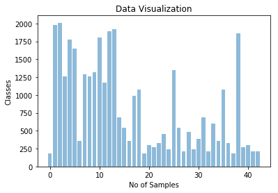
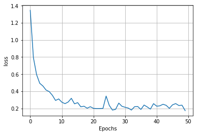
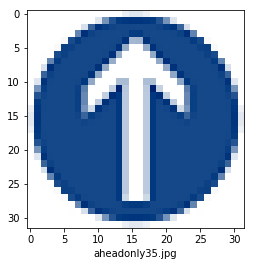
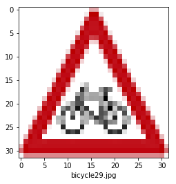
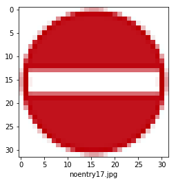
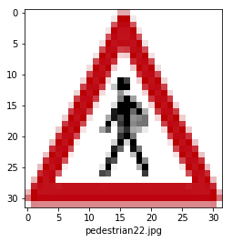
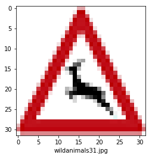

# Self-Driving Car Engineer Nanodegree

## Deep Learning

## Project: Build a Traffic Sign Recognition Classifier

### Note- I am training and running code on CUDA powered by NVIDIA GEFORCE 940MX instead of AWS. The model takes only 20% of the entire Graphic Card Load.

---
## Step 0: Load The Data


```python
"""
#only to load dataset from internet
from urllib.request import urlretrieve
import os
import numpy as np
from sklearn.preprocessing import LabelBinarizer
from zipfile import ZipFile
import math

def download(url, file):
    if not os.path.isfile(file):
        print("Download file... " + file + " ...")
        urlretrieve(url,file)
        print("File downloaded")

download('https://d17h27t6h515a5.cloudfront.net/topher/2017/February/5898cd6f_traffic-signs-data/traffic-signs-data.zip','data.zip')
print("All the files are downloaded")
"""
```


```python
"""
#only to load dataset from internet
def uncompress_features_labels(dir):
    if(os.path.isdir('traffic-data')):
        print('Data extracted')
    else:
        with ZipFile(dir) as zipf:
            zipf.extractall('traffic-signs-data')
uncompress_features_labels('data.zip')

def data_Files(mypath):
    onlyfiles = [f for f in os.listdir(mypath) if os.path.isfile(os.path.join(mypath, f))]
    print(onlyfiles)
"""
```


```python
# Load pickled data
import pickle

# TODO: Fill this in based on where you saved the training and testing data

training_file = './traffic-signs-data/train.p'
validation_file='./traffic-signs-data/valid.p'
testing_file = './traffic-signs-data/test.p'

with open(training_file, mode='rb') as f:
    train = pickle.load(f)
with open(validation_file, mode='rb') as f:
    valid = pickle.load(f)
with open(testing_file, mode='rb') as f:
    test = pickle.load(f)
    
X_train, y_train = train['features'], train['labels']
X_valid, y_valid = valid['features'], valid['labels']
X_test, y_test = test['features'], test['labels']
print("Data Loaded from pickle files!")
```

---

## Step 1: Dataset Summary & Exploration

The pickled data is a dictionary with 4 key/value pairs:

- `'features'` is a 4D array containing raw pixel data of the traffic sign images, (num examples, width, height, channels).
- `'labels'` is a 1D array containing the label/class id of the traffic sign. The file `signnames.csv` contains id -> name mappings for each id.
- `'sizes'` is a list containing tuples, (width, height) representing the original width and height the image.
- `'coords'` is a list containing tuples, (x1, y1, x2, y2) representing coordinates of a bounding box around the sign in the image. **THESE COORDINATES ASSUME THE ORIGINAL IMAGE. THE PICKLED DATA CONTAINS RESIZED VERSIONS (32 by 32) OF THESE IMAGES**


###  Basic Summary of the Data Set Using Pandas


```python
### Replace each question mark with the appropriate value. 
### Use python, pandas or numpy methods rather than hard coding the results


import numpy as np

# Number of training examples
n_train = np.shape(X_train)[0]

# Number of validation examples
n_validation = np.shape(X_valid)[0]

# Number of testing examples.
n_test = np.shape(X_test)[0]

# What's the shape of an traffic sign image?
image_shape = np.shape(X_train[0])

# How many unique classes/labels there are in the dataset.
n_classes = len(np.unique(y_train))

print("Number of training examples =", n_train)
print("Number of validation examples =", n_validation)
print("Number of testing examples =", n_test)
print("Image data shape =", image_shape)
print("Number of classes =", n_classes)
```

    Number of training examples = 34799
    Number of validation examples = 4410
    Number of testing examples = 12630
    Image data shape = (32, 32, 3)
    Number of classes = 43
    

### Exploratory visualization of the dataset


```python
### Data exploration visualization code goes here.
### Feel free to use as many code cells as needed.
import matplotlib.pyplot as plt
# Visualizations will be shown in the notebook.
%matplotlib inline


#uni,index,count=np.unique(y_train,return_index=true,return_count=true)
class_arr= []
samples_arr=[]

for class_n in range(n_classes):
    class_indices = np.where(y_train == class_n)
    n_samples = len(class_indices[0])
    class_arr.append(class_n)
    samples_arr.append(n_samples)
    
#plt.hist(y_train,bins=43)
plt.bar( class_arr, samples_arr,align='center', alpha=0.5)
plt.ylabel('Classes')
plt.xlabel('No of Samples')
plt.title('Data Visualization')
plt.show()

```





----

## Step 2: Design and Test a Model Architecture


### Pre-process the Data Set

### Question 1

*Describe how you preprocessed the image data.*

#### Answer-
Here I just shuffled the data as a part of preprocessing just to make sure that the order in which the data comes does not matters to CNN


```python
#Shuffle Data

from sklearn.utils import shuffle
X_train, y_train = shuffle(X_train, y_train)
```

### Model Architecture

### Question 2 
*Describe what your final model architecture looks like including model type, layers, layer sizes, connectivity, etc.) Consider including a diagram and/or table describing the final model*

#### Answer-

I studied LeNet Architecture and I started implementing LeNet Architecture but soon I realized that there is a need of additional Convolutional Layer and Fully Connected Layer. So below I am describing my modified LeNet Architecture.

| Layer            | Description                                                 |
|------------------|-------------------------------------------------------------|
| Input            | 32x32x3 RGB image                                           |
| Convolution      | 5x5 filter with 1x1 stride, valid padding, outputs 28x28x6  |
| RELU             |                                                             |
| Convolution      | 5x5 filter with 2x2 stride, valid padding, outputs 14x14x10 |
| RELU             |                                                             |
| Convolution      | 5x5 filter with 1x1 stride, valid padding, outputs 8x8x16   |
| RELU             |                                                             |
| Max Pooling      | 2x2 ksize with 2x2 stride, valid padding, outputs 4x4x16    |
| Flatten          | outputs 256                                                 |
| Fully Connected  | Input 256 and outputs 120                                   |
| RELU             |                                                             |
| Dropout          | keep_prob=0.5                                               |
| Fully Connected  | Inputs 120 and outputs 100                                  |
| RELU             |                                                             |
| Fully Connected  | Inputs 100 and outputs 84                                   |
| RELU             |                                                             |
| Fully Connected  | Inputs 84 and outputs 43                                    |
|                  |                                                             |
|                  |                                                             |


```python
#importing tensorflow
import tensorflow as tf

#setting the hyperparameters, no of iterations and batch_size
EPOCHS = 50
BATCH_SIZE = 128
```


```python
from tensorflow.contrib.layers import flatten

def LeNet(x):    
    # Arguments used for tf.truncated_normal, randomly defines variables for the weights and biases for each layer
    mu = 0
    sigma = 0.1
    
    # Layer 1: Convolutional. Input = 32x32x3. Output = 28x28x6.
    conv1_W= tf.Variable(tf.truncated_normal(shape=(5,5,3,6), mean=mu, stddev=sigma))
    conv1_b= tf.Variable(tf.zeros(6))
    conv1= tf.nn.conv2d(x,conv1_W,strides=[1,1,1,1],padding='VALID',use_cudnn_on_gpu=True) + conv1_b

    # Activation.
    conv1= tf.nn.relu(conv1)

    # Layer 2: Convolutional. Input = 28x28x6. Output = 14x14x10.
    conv3_W= tf.Variable(tf.truncated_normal(shape=(5,5,6,10), mean=mu, stddev=sigma))
    conv3_b= tf.Variable(tf.zeros(10))
    conv3= tf.nn.conv2d(conv1,conv3_W,strides=[1,2,2,1],padding='VALID',use_cudnn_on_gpu=True) + conv3_b

    # Activation.
    conv3= tf.nn.relu(conv3)

    # Layer 3: Convolutional. Input = 14x14x10. Output = 8x8x16.
    conv2_W= tf.Variable(tf.truncated_normal(shape=(5,5,10,16),mean=mu,stddev=sigma))
    conv2_b=tf.Variable(tf.zeros(16))
    conv2= tf.nn.conv2d(conv3,conv2_W,strides=[1,1,1,1],padding='VALID',use_cudnn_on_gpu=True) + conv2_b
    
    # Activation.
    conv2= tf.nn.relu(conv2)

    # Pooling. Input = 8x8x16. Output = 4x4x16.
    conv2= tf.nn.max_pool(conv2,ksize=[1,2,2,1],strides=[1,2,2,1],padding='VALID')

    # Flatten. Input = 4x4x16. Output = 256.
    f= flatten(conv2)

    # Layer 4: Fully Connected. Input = 256. Output = 120.
    fc1_W= tf.Variable(tf.truncated_normal(shape=(int(np.shape(f)[1]),120),mean=mu,stddev=sigma))
    fc1_b= tf.Variable(tf.zeros(shape=120))
    fc1= tf.matmul(f,fc1_W) + fc1_b
    
    # Activation.
    fc1= tf.nn.relu(fc1)
    
    # Introduce Dropout after first fully connected layer
    fc1 = tf.nn.dropout(fc1, keep_prob)

    # Layer 5: Fully Connected. Input = 120. Output = 100.
    fc2_W= tf.Variable(tf.truncated_normal(shape=(120,100),mean=mu,stddev=sigma))
    fc2_b= tf.Variable(tf.zeros(100))
    fc2= tf.matmul(fc1,fc2_W) + fc2_b
    
    # Activation.
    fc2= tf.nn.relu(fc2)
    
    # Layer 6: Fully Connected. Input = 100. Output = 84.
    fc4_W= tf.Variable(tf.truncated_normal(shape=(100,84),mean=mu,stddev=sigma))
    fc4_b= tf.Variable(tf.zeros(84))
    fc4= tf.matmul(fc2,fc4_W) + fc4_b
    
    # Activation.
    fc4= tf.nn.relu(fc4)
    
    # Layer 7: Fully Connected. Input = 84. Output = 43.
    fc3_W= tf.Variable(tf.truncated_normal(shape=(84,43),mean=mu,stddev=sigma))
    fc3_b= tf.Variable(tf.zeros(43))
    fc3= tf.matmul(fc4,fc3_W) + fc3_b
    logits=fc3
        
    return logits
```


```python
x = tf.placeholder(tf.float32, (None, 32, 32, 3))
y = tf.placeholder(tf.int32, (None))
one_hot_y = tf.one_hot(y, 43) # one hot encoding for output labels
keep_prob = tf.placeholder(tf.float32) # defining the dropout probability after fully connected layer in the architecture
print('Variables initialized successfully')
```

    Variables initialized successfully
    

### Question 3
*How did you train your model? The type of optimizer, the batch size, number of epochs and any hyperparameters such as learning rate*

#### Answer-

I trained my model using the following hyperparameters-

* Epochs - 50

* Batch Size - 128

* Learning Rate - 0.0009

* Optimizer- AdamOptimizer

* mu - 0

* sigma - 0.1

* dropout keep probability - 0.5

### Train, Validate and Test the Model

A validation set can be used to assess how well the model is performing. A low accuracy on the training and validation
sets imply underfitting. A high accuracy on the training set but low accuracy on the validation set implies overfitting.


```python
rate = 0.0009 #learning rate

#defining various operations
logits = LeNet(x) 
cross_entropy = tf.nn.softmax_cross_entropy_with_logits(labels=one_hot_y, logits=logits)
loss_operation = tf.reduce_mean(cross_entropy)
optimizer = tf.train.AdamOptimizer(learning_rate = rate)
training_operation = optimizer.minimize(loss_operation)
```


```python
correct_prediction = tf.equal(tf.argmax(logits, 1), tf.argmax(one_hot_y, 1))
accuracy_operation = tf.reduce_mean(tf.cast(correct_prediction, tf.float32))
saver = tf.train.Saver()

def evaluate(X_data, y_data):
    num_examples = len(X_data)
    total_accuracy = 0
    total_loss=0
    sess = tf.get_default_session()
    for offset in range(0, num_examples, BATCH_SIZE):
        batch_x, batch_y = X_data[offset:offset+BATCH_SIZE], y_data[offset:offset+BATCH_SIZE]
        accuracy,loss = sess.run([accuracy_operation,loss_operation],feed_dict={x: batch_x, y: batch_y,keep_prob:1})
        total_accuracy += (accuracy * len(batch_x))
        total_loss+= (loss*len(batch_x)) # getting the total loss to plot a graph later
    return total_accuracy / num_examples, total_loss/num_examples
```


```python
with tf.Session() as sess:
    sess.run(tf.global_variables_initializer())
    num_examples = len(X_train)
    
    print("Training...")
    print()
    loss_Acc=[]
    for i in range(EPOCHS):
        X_train, y_train = shuffle(X_train, y_train)
        for offset in range(0, num_examples, BATCH_SIZE):
            end = offset + BATCH_SIZE
            batch_x, batch_y = X_train[offset:end], y_train[offset:end]
            sess.run(training_operation, feed_dict={x: batch_x, y: batch_y,keep_prob:0.5})
            
        validation_accuracy,loss_acc = evaluate(X_valid, y_valid)
       
        print("EPOCH {} ...".format(i+1))
        loss_Acc.append(loss_acc)
        print("Validation Accuracy = {:.3f}".format(validation_accuracy))
        print()
    plt.plot(range(0,EPOCHS),loss_Acc)
    plt.ylabel('loss')
    plt.xlabel('Epochs')
    plt.grid(True)
    plt.show()
    saver.save(sess, './trafficTest')
    print("Model saved")
```

    Training...
    
    EPOCH 1 ...
    Validation Accuracy = 0.639
    
    EPOCH 2 ...
    Validation Accuracy = 0.777
    
    EPOCH 3 ...
    Validation Accuracy = 0.837
    
    EPOCH 4 ...
    Validation Accuracy = 0.873
    
    EPOCH 5 ...
    Validation Accuracy = 0.888
    
    EPOCH 6 ...
    Validation Accuracy = 0.907
    
    EPOCH 7 ...
    Validation Accuracy = 0.910
    
    EPOCH 8 ...
    Validation Accuracy = 0.915
    
    EPOCH 9 ...
    Validation Accuracy = 0.927
    
    EPOCH 10 ...
    Validation Accuracy = 0.932
    
    EPOCH 11 ...
    Validation Accuracy = 0.936
    
    EPOCH 12 ...
    Validation Accuracy = 0.944
    
    EPOCH 13 ...
    Validation Accuracy = 0.935
    
    EPOCH 14 ...
    Validation Accuracy = 0.933
    
    EPOCH 15 ...
    Validation Accuracy = 0.940
    
    EPOCH 16 ...
    Validation Accuracy = 0.946
    
    EPOCH 17 ...
    Validation Accuracy = 0.946
    
    EPOCH 18 ...
    Validation Accuracy = 0.949
    
    EPOCH 19 ...
    Validation Accuracy = 0.958
    
    EPOCH 20 ...
    Validation Accuracy = 0.953
    
    EPOCH 21 ...
    Validation Accuracy = 0.954
    
    EPOCH 22 ...
    Validation Accuracy = 0.955
    
    EPOCH 23 ...
    Validation Accuracy = 0.957
    
    EPOCH 24 ...
    Validation Accuracy = 0.961
    
    EPOCH 25 ...
    Validation Accuracy = 0.942
    
    EPOCH 26 ...
    Validation Accuracy = 0.953
    
    EPOCH 27 ...
    Validation Accuracy = 0.963
    
    EPOCH 28 ...
    Validation Accuracy = 0.963
    
    EPOCH 29 ...
    Validation Accuracy = 0.953
    
    EPOCH 30 ...
    Validation Accuracy = 0.957
    
    EPOCH 31 ...
    Validation Accuracy = 0.959
    
    EPOCH 32 ...
    Validation Accuracy = 0.956
    
    EPOCH 33 ...
    Validation Accuracy = 0.961
    
    EPOCH 34 ...
    Validation Accuracy = 0.957
    
    EPOCH 35 ...
    Validation Accuracy = 0.955
    
    EPOCH 36 ...
    Validation Accuracy = 0.965
    
    EPOCH 37 ...
    Validation Accuracy = 0.951
    
    EPOCH 38 ...
    Validation Accuracy = 0.954
    
    EPOCH 39 ...
    Validation Accuracy = 0.962
    
    EPOCH 40 ...
    Validation Accuracy = 0.957
    
    EPOCH 41 ...
    Validation Accuracy = 0.960
    
    EPOCH 42 ...
    Validation Accuracy = 0.958
    
    EPOCH 43 ...
    Validation Accuracy = 0.954
    
    EPOCH 44 ...
    Validation Accuracy = 0.961
    
    EPOCH 45 ...
    Validation Accuracy = 0.963
    
    EPOCH 46 ...
    Validation Accuracy = 0.959
    
    EPOCH 47 ...
    Validation Accuracy = 0.951
    
    EPOCH 48 ...
    Validation Accuracy = 0.955
    
    EPOCH 49 ...
    Validation Accuracy = 0.955
    
    EPOCH 50 ...
    Validation Accuracy = 0.961
    
    





    Model saved
    


```python
# Check Test Accuracy

with tf.Session() as sess:
    saver.restore(sess, tf.train.latest_checkpoint('.'))
    test_accuracy = evaluate(X_test, y_test)
    print("Test Accuracy = {:.3f}".format(test_accuracy[0]))
```

    INFO:tensorflow:Restoring parameters from .\trafficTest
    Test Accuracy = 0.953
    

### Question 4
*Describe the approach taken for finding a solution and getting the validation set accuracy to be at least 0.93*

#### Answer-

My final model results were:

* Validation Set Accuracy: 96.1%

* Test Set Accuracy: 95.3%

* In the starting I chose to implement predefined LeNet Architecture and it ran pretty good giving a validation acccuracy of around 90% but still a lot of work had to be done to get it beyond 93%.

* The problem with the LeNet architecture was that it took one channel images as input and in the final output it returned 10 classes. Since we require here 43 classes and 3 channel images so the corresponding layers were updated

* After implenting and adjusting the LeNet Architecture according to our needs the next step was purely hit and trials and random experimentation around convolutional layers. I decided to add one convolution layer and drop max pooling in the first layer so as not to reduce the output size much and CNN can grasp maximum. I then decided to add one fully connected layer which was just a part of experimentation.

* Doing this I was able to achieve 94% accuracy but I decided to lower my learning rate from 0.001 to 0.0009 and increase the Epochs from 30 to 50 so as to train model more efficiently.

* Now I could see that the validation accuracy was fluctating around 94 and 95. So at this time I decided to introduce dropout with keep_prob as 0.5 after first fully connected layer. This was the time my accuracy started fluctuating between 95 and 96.5.

---

## Step 3: Test a Model on New Images

To give yourself more insight into how your model is working, download at least five pictures of German traffic signs from the web and use your model to predict the traffic sign type.

You may find `signnames.csv` useful as it contains mappings from the class id (integer) to the actual sign name.

### Load and Output the Images


```python
### Load the images and plot them here.
### Feel free to use as many code cells as needed.
import os
import matplotlib.image as mpimg
import cv2
import matplotlib.pyplot as plt
import numpy as np

my_images = []

for i, img in enumerate(os.listdir('traffic-signs-real/new/')):
    image = cv2.imread('traffic-signs-real/new/' + img)
    my_images.append(image)
    plt.figure()
    plt.xlabel(img)
    plt.imshow(cv2.cvtColor(image, cv2.COLOR_BGR2RGB))


my_images = np.asarray(my_images)


```

















### Predict the Sign Type for Each Image and Analyze Performance


```python
### Run the predictions here and use the model to output the prediction for each image.
### Make sure to pre-process the images with the same pre-processing pipeline used earlier.
### Feel free to use as many code cells as needed.

my_labels = [35,29,17, 27, 31]
# Check Test Accuracy

with tf.Session() as sess:
    saver.restore(sess, tf.train.latest_checkpoint('.'))
    output_accuracy = evaluate(my_images, my_labels)
    print("Test Accuracy = {:.3f}".format(output_accuracy[0]))
```

    INFO:tensorflow:Restoring parameters from .\trafficTest
    Test Accuracy = 1.000
    

### Question 5

*Discuss the model's predictions on these new traffic signs and compare the results to predicting on the test set. At a minimum, discuss what the predictions were, the accuracy on these new predictions, and compare the accuracy to the accuracy on the test set*

#### Answer-

The model's predictions on these new traffic signs were spot on. Below are the results-

| Image                | Prediction           |
|----------------------|----------------------|
| Ahead Only           | Ahead Only           |
| Bicycle Only         | Bicycle Only         |
| No Entry             | No Entry             |
| Pedestrian           | Pedestrian           |
| Wild Animal Crossing | Wild Animal Crossing |


The model was able to correctly guess 5 of the 5 traffic signs, which gives an accuracy of 100%. This compares favorably to the accuracy on the test set of 95%


### Output Top 5 Softmax Probabilities For Each Image Found on the Web

For each of the new images, print out the model's softmax probabilities to show the **certainty** of the model's predictions (limit the output to the top 5 probabilities for each image). [`tf.nn.top_k`](https://www.tensorflow.org/versions/r0.12/api_docs/python/nn.html#top_k) could prove helpful here. 

The example below demonstrates how tf.nn.top_k can be used to find the top k predictions for each image.

`tf.nn.top_k` will return the values and indices (class ids) of the top k predictions. So if k=3, for each sign, it'll return the 3 largest probabilities (out of a possible 43) and the correspoding class ids.

Take this numpy array as an example. The values in the array represent predictions. The array contains softmax probabilities for five candidate images with six possible classes. `tf.nn.top_k` is used to choose the three classes with the highest probability:

```
# (5, 6) array
a = np.array([[ 0.24879643,  0.07032244,  0.12641572,  0.34763842,  0.07893497,
         0.12789202],
       [ 0.28086119,  0.27569815,  0.08594638,  0.0178669 ,  0.18063401,
         0.15899337],
       [ 0.26076848,  0.23664738,  0.08020603,  0.07001922,  0.1134371 ,
         0.23892179],
       [ 0.11943333,  0.29198961,  0.02605103,  0.26234032,  0.1351348 ,
         0.16505091],
       [ 0.09561176,  0.34396535,  0.0643941 ,  0.16240774,  0.24206137,
         0.09155967]])
```

Running it through `sess.run(tf.nn.top_k(tf.constant(a), k=3))` produces:

```
TopKV2(values=array([[ 0.34763842,  0.24879643,  0.12789202],
       [ 0.28086119,  0.27569815,  0.18063401],
       [ 0.26076848,  0.23892179,  0.23664738],
       [ 0.29198961,  0.26234032,  0.16505091],
       [ 0.34396535,  0.24206137,  0.16240774]]), indices=array([[3, 0, 5],
       [0, 1, 4],
       [0, 5, 1],
       [1, 3, 5],
       [1, 4, 3]], dtype=int32))
```

Looking just at the first row we get `[ 0.34763842,  0.24879643,  0.12789202]`, you can confirm these are the 3 largest probabilities in `a`. You'll also notice `[3, 0, 5]` are the corresponding indices.

### Question 6

*Describe how certain the model is when predicting on each of the five new images by looking at the softmax probabilities for each prediction. Provide the top 3 softmax probabilities for each image along with the sign type of each probability. *

#### Answer-


| Input Image Label and Class | First Guess Label and Class | Second Guess Label and Class | Third Guess Label and Class              |
|-----------------------------|-----------------------------|------------------------------|------------------------------------------|
| 35,Ahead only               | 35,Ahead only               | 3,Speed limit,(60km/h)       | 34,Turn left ahead                       |
| 29,Bicycles crossing        | 29,Bicycles crossing        | 18,General caution           | 28,Children crossing                     |
| 17,No entry                 | 17,No entry                 | 14,Stop                      | 36,Go straight or right                  |
| 27,Pedestrians              | 27,Pedestrians              | 18,General caution           | 11,Right-of-way at the next intersection |
| 31,Wild animals crossing    | 31,Wild animals crossing    | 18,General caution           | 21,Double curve                          |


```python
### Print out the top five softmax probabilities for the predictions on the German traffic sign images found on the web. 
### Feel free to use as many code cells as needed.
softmax_logits = tf.nn.softmax(logits)
top_k = tf.nn.top_k(softmax_logits, k=3)


with tf.Session() as sess:
    sess.run(tf.global_variables_initializer())
    saver.restore(sess, tf.train.latest_checkpoint('.'))
    my_softmax_logits = sess.run(softmax_logits, feed_dict={x: my_images, keep_prob: 1.0})
    my_top_k = sess.run(top_k, feed_dict={x: my_images, keep_prob: 1.0})
    print(my_softmax_logits)
    print(my_top_k)
    
    
    
   
```

    INFO:tensorflow:Restoring parameters from .\trafficTest
    [[  2.40223004e-35   5.26937066e-30   4.30118183e-36   4.38751107e-14
        0.00000000e+00   9.09599880e-33   0.00000000e+00   0.00000000e+00
        0.00000000e+00   6.02416353e-33   1.96233196e-37   2.06073276e-28
        6.44456373e-27   3.68377680e-25   0.00000000e+00   2.58605091e-27
        0.00000000e+00   0.00000000e+00   5.33484713e-28   3.62773308e-31
        5.54953742e-30   0.00000000e+00   0.00000000e+00   1.03900406e-35
        0.00000000e+00   5.19553535e-24   1.22194215e-26   4.21680267e-34
        3.72795753e-23   1.80639343e-21   0.00000000e+00   0.00000000e+00
        5.23930057e-32   4.51706086e-31   1.47148245e-19   1.00000000e+00
        3.06949900e-28   3.06393828e-23   2.91278390e-33   3.88339218e-29
        2.91609714e-33   1.76539571e-37   3.28433930e-33]
     [  8.06202071e-18   7.22548321e-25   3.96873901e-30   8.91925363e-17
        1.38030393e-30   6.34929558e-28   1.81086512e-35   0.00000000e+00
        5.57549709e-27   5.85085324e-35   1.62449316e-36   4.30753489e-14
        4.16950755e-25   1.51185016e-22   2.50827646e-26   1.01453145e-23
        0.00000000e+00   5.57933930e-30   1.89893590e-09   6.00429399e-26
        1.98146827e-22   1.35573563e-15   7.03566371e-16   2.19046935e-13
        7.34317892e-20   9.29920911e-18   5.08619646e-10   3.28634589e-17
        1.03167574e-09   1.00000000e+00   1.87277496e-17   1.06007285e-16
        3.63752954e-24   1.46373449e-26   4.15157825e-15   7.31439843e-16
        5.21962276e-20   2.55304134e-17   8.12135256e-17   6.46067893e-22
        7.61657446e-30   2.76613687e-31   1.02476927e-30]
     [  3.32852039e-34   0.00000000e+00   0.00000000e+00   2.71207697e-38
        0.00000000e+00   0.00000000e+00   0.00000000e+00   0.00000000e+00
        0.00000000e+00   1.66440720e-28   4.37233057e-37   0.00000000e+00
        7.54185053e-34   8.83531641e-37   1.86134722e-21   0.00000000e+00
        0.00000000e+00   1.00000000e+00   0.00000000e+00   0.00000000e+00
        9.78406766e-35   0.00000000e+00   3.63067293e-36   0.00000000e+00
        0.00000000e+00   3.92516749e-37   0.00000000e+00   0.00000000e+00
        4.68283202e-38   1.75130941e-30   0.00000000e+00   0.00000000e+00
        0.00000000e+00   2.22209669e-36   3.51470264e-36   1.26295905e-34
        6.97925211e-26   0.00000000e+00   0.00000000e+00   0.00000000e+00
        0.00000000e+00   8.14750636e-33   0.00000000e+00]
     [  2.05336912e-23   9.31236218e-21   6.13510808e-26   3.72036861e-24
        1.25446246e-30   3.53861342e-33   8.30486851e-34   2.41394050e-36
        3.13973308e-38   1.20279697e-31   1.26999563e-30   3.10789900e-08
        2.96803390e-19   1.26418975e-31   2.33868153e-28   1.01394809e-36
        8.67201029e-34   1.43962060e-30   2.48234699e-07   9.78771880e-21
        5.46279601e-13   1.51642249e-13   9.52103190e-27   2.23352993e-18
        7.57841164e-13   6.52518878e-14   5.14564389e-12   9.99999762e-01
        3.94493088e-17   1.46350787e-15   1.44760641e-14   6.37640969e-27
        8.34980232e-30   4.18317478e-18   1.49688171e-24   3.19399334e-26
        1.77783348e-26   8.83041983e-24   1.41254806e-20   2.10453779e-20
        3.23122144e-20   4.98281340e-23   3.67771128e-32]
     [  1.50380741e-17   7.91416813e-20   8.31341810e-22   9.84709798e-18
        1.68964096e-25   1.31862230e-25   3.08314719e-36   1.08300969e-35
        1.02495621e-32   1.88916680e-29   1.38746244e-23   1.36143308e-09
        2.08021437e-24   2.29831272e-25   2.39837635e-27   2.39527570e-28
        0.00000000e+00   1.64415478e-31   2.57880194e-04   6.74880612e-25
        1.40235654e-15   1.10198467e-04   7.45757015e-12   1.14818133e-09
        1.19795673e-10   1.40141293e-11   2.91765639e-10   3.54758896e-11
        8.43130090e-14   5.40153314e-06   1.16756353e-11   9.99626517e-01
        1.44541690e-36   4.88503930e-24   3.01008085e-23   5.98024441e-20
        1.18390450e-26   3.53713318e-24   1.20267434e-15   1.26041202e-21
        6.98785379e-20   2.38948718e-30   2.88449063e-32]]
    TopKV2(values=array([[  1.00000000e+00,   4.38751107e-14,   1.47148245e-19],
           [  1.00000000e+00,   1.89893590e-09,   1.03167574e-09],
           [  1.00000000e+00,   1.86134722e-21,   6.97925211e-26],
           [  9.99999762e-01,   2.48234699e-07,   3.10789900e-08],
           [  9.99626517e-01,   2.57880194e-04,   1.10198467e-04]], dtype=float32), indices=array([[35,  3, 34],
           [29, 18, 28],
           [17, 14, 36],
           [27, 18, 11],
           [31, 18, 21]]))
    


```python
### Visualize your network's feature maps here.
### Feel free to use as many code cells as needed.

# image_input: the test image being fed into the network to produce the feature maps
# tf_activation: should be a tf variable name used during your training procedure that represents the calculated state of a specific weight layer
# activation_min/max: can be used to view the activation contrast in more detail, by default matplot sets min and max to the actual min and max values of the output
# plt_num: used to plot out multiple different weight feature map sets on the same block, just extend the plt number for each new feature map entry

def outputFeatureMap(image_input, tf_activation, activation_min=-1, activation_max=-1 ,plt_num=1):
    # Here make sure to preprocess your image_input in a way your network expects
    # with size, normalization, ect if needed
    # image_input =
    # Note: x should be the same name as your network's tensorflow data placeholder variable
    # If you get an error tf_activation is not defined it may be having trouble accessing the variable from inside a function
    activation = tf_activation.eval(session=sess,feed_dict={x : image_input})
    featuremaps = activation.shape[3]
    plt.figure(plt_num, figsize=(15,15))
    for featuremap in range(featuremaps):
        plt.subplot(6,8, featuremap+1) # sets the number of feature maps to show on each row and column
        plt.title('FeatureMap ' + str(featuremap)) # displays the feature map number
        if activation_min != -1 & activation_max != -1:
            plt.imshow(activation[0,:,:, featuremap], interpolation="nearest", vmin =activation_min, vmax=activation_max, cmap="gray")
        elif activation_max != -1:
            plt.imshow(activation[0,:,:, featuremap], interpolation="nearest", vmax=activation_max, cmap="gray")
        elif activation_min !=-1:
            plt.imshow(activation[0,:,:, featuremap], interpolation="nearest", vmin=activation_min, cmap="gray")
        else:
            plt.imshow(activation[0,:,:, featuremap], interpolation="nearest", cmap="gray")
```

| Input Image Label and Class | First Guess Label and Class | Second Guess Label and Class | Third Guess Label and Class              |
|-----------------------------|-----------------------------|------------------------------|------------------------------------------|
| 35,Ahead only               | 35,Ahead only(100%)               | 3,Speed limit,(60km/h)(0%)       | 34,Turn left ahead(0%)                       |
| 29,Bicycles crossing        | 29,Bicycles crossing(100%)        | 18,General caution(0%)           | 28,Children crossing(0%)                     |
| 17,No entry                 | 17,No entry(100%)                 | 14,Stop(0%)                      | 36,Go straight or right(0%)                  |
| 27,Pedestrians              | 27,Pedestrians(99%)              | 18,General caution(.0023% ~ 0%)           | 11,Right-of-way  at the next intersection (0.000031% ~ 0%) |
| 31,Wild animals crossing (100%)   | 31,Wild animals crossing (0%)   | 18,General caution (0%)          | 21,Double curve   (0%)                       |


```python


top_k = tf.nn.top_k(softmax_logits, k=5)


with tf.Session() as sess:
    sess.run(tf.global_variables_initializer())
    my_top_k = sess.run(top_k)
    print(my_top_k)
```

    TopKV2(values=array([[1.0000000e+00, 4.3875111e-14, 1.4714824e-19, 1.8063934e-21,
            3.7279575e-23],
           [1.0000000e+00, 1.8989359e-09, 1.0316757e-09, 5.0861965e-10,
            2.1904693e-13],
           [1.0000000e+00, 1.8613472e-21, 6.9792521e-26, 1.6644072e-28,
            1.7513094e-30],
           [9.9999976e-01, 2.4823470e-07, 3.1078990e-08, 5.1456439e-12,
            7.5784116e-13],
           [9.9962652e-01, 2.5788019e-04, 1.1019847e-04, 5.4015331e-06,
            1.3614331e-09]], dtype=float32), indices=array([[35,  3, 34, 29, 28],
           [29, 18, 28, 26, 23],
           [17, 14, 36,  9, 29],
           [27, 18, 11, 26, 24],
           [31, 18, 21, 29, 11]]))
    
